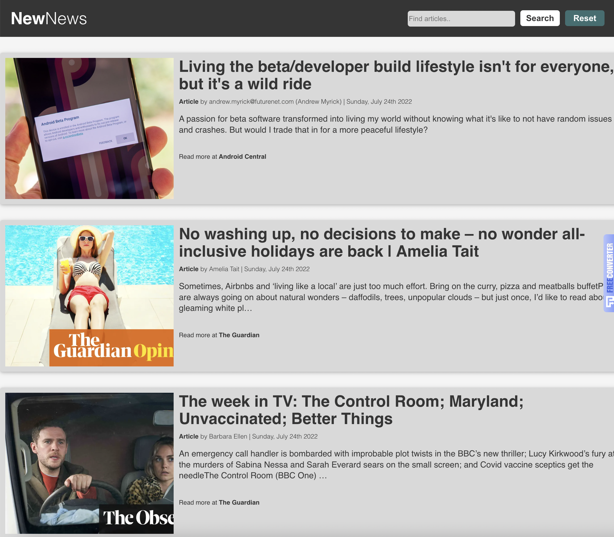
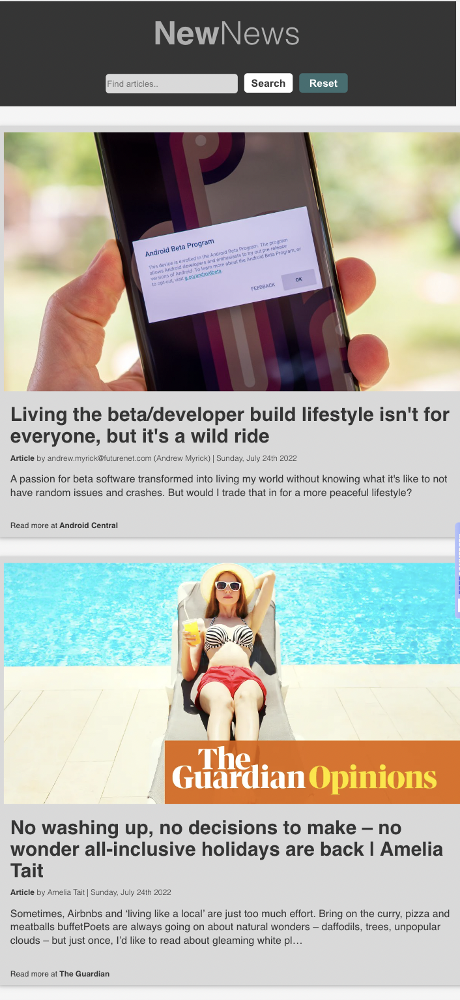

<h1 align="center">NewNews</h1>

## Description

NewNews is a single page, mobile responsive news feed app. The user will see top headlines, and will be able to read the articles by clicking on source link.

## Future Development

The user will be able to search for topics in the navigation search bar, the the results will populate below. The reset button will refresh the news feed back to its previous state.

## Built With

- ReactJS
- MomentJS

## Website

Visit [NewNews](https://nicolebarranca.github.io/newnews/).

 

 

## Contribution

Made with ❤️ by Nicole Barranca

## Questions

Feel free to contact me directly at nikkibarranca@gmail.com if you have any questions about the repo.

You can find more of my work at [Nicole Barranca](https://github.com/NicoleBarranca).
